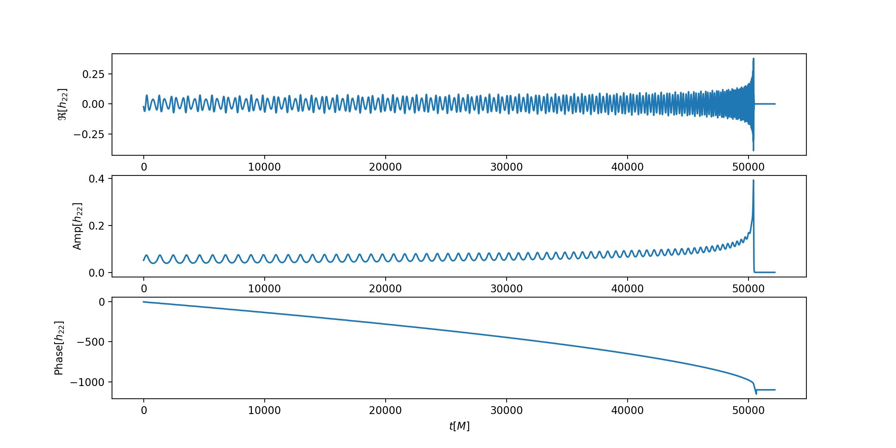
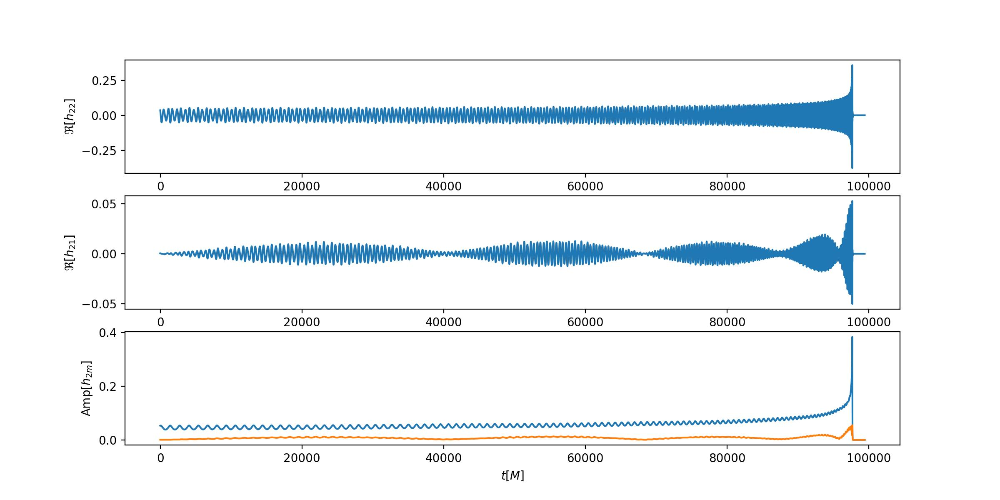

# pyWaveformGenerator of SEOBNRE
Python module calculate GW waveform

## Pre-requisites
```bash
sudo apt-get update
sudo apt-get install libgsl-dev
sudo apt-get install cmake
```


## Compile C code and install libraries
```bash
mkdir build
cd build
cmake ..
make
make install
```

## Install Python package
```bash
cd ..
pip install -r requirements.txt
pip install -e .
```
sometimes the lib cannot use in Apple core macbook.


## Run in python
This is Tutorial in `example/tutorial.ipynb`
```python
from pySEOBNREPHM.waveform import calculate_waveform

m1 = m2 = 10
chi1x = chi1y = chi1z = 0
chi2x = chi2y = chi2z = 0
e0 = 0
dL = 100
zeta_rad = iota_rad = beta_rad = Phic_rad = 0
fMin = 20
waveform, dynamics = calculate_waveform((m1, m2, 
	chi1x, chi1y, chi1z, 
	chi2x, chi2y, chi2z, 
	e0, dL, 
	zeta_rad, iota_rad, 
  beta_rad, Phic_rad), fMin)
```
see more details and description in waveform.py

Cite this repo via [arXiv:2102.08614](https://arxiv.org/abs/2102.08614)  and [arXiv:2310.04552](https://arxiv.org/abs/2310.04552).

Generate eccentric-precession waveform, run

```python
from pySEOBNREPHM.waveform import calculate_waveform_ep

m1 = m2 = 10
chi1x = 0.2
chi1y = chi1z = 0
chi2y = -0.3
chi2x = chi2z = 0
e0 = 0.2
dL = 100
zeta_rad = 0
iota_rad = beta_rad = Phic_rad = 0
fMin = 20
Mf_ref = 0.003
waveform, dynamics = calculate_waveform_ep((m1, m2, 
	chi1x, chi1y, chi1z, 
	chi2x, chi2y, chi2z, 
	e0, dL, 
	zeta_rad, iota_rad, 
  beta_rad, Phic_rad), fMin, Mf_ref = Mf_ref, srate=16384, is_coframe=False)
```

In this case one have to make sure that one of $\chi_{1x,1y,2x,2y}\neq0$.

Then we can see the waveform

```Python
import matplotlib.pyplot as plt

h22 = waveform.h22
fig = plt.figure(figsize = (12, 6))

ax1 = fig.add_subplot(3, 1, 1)
ax2 = fig.add_subplot(3, 1, 2)
ax3 = fig.add_subplot(3, 1, 3)

ax1.plot(h22.time, h22.real)
ax1.set_ylabel(r'$\Re[h_{22}]$')

ax2.plot(h22.time, h22.amp)
ax2.set_ylabel(r'${\rm Amp}[h_{22}]$')

ax3.plot(h22.time, h22.phase)
ax3.set_ylabel(r'${\rm Phase}[h_{22}]$')

ax3.set_xlabel(r'$t[M]$')
plt.show()
```

which will looks like



## Anomaly and reference frequency

```python
from pySEOBNREPHM.waveform import calculate_waveform

m1 = m2 = 10
chi1x = chi1y = chi1z = 0
chi2x = chi2y = chi2z = 0
e0 = 0.3
dL = 100
iota_rad = beta_rad = Phic_rad = 0
zeta_rad = 30 * np.pi/180
fMin = 20
Mf_ref = 0.003
waveform, dynamics = calculate_waveform((m1, m2, 
	chi1x, chi1y, chi1z, 
	chi2x, chi2y, chi2z, 
	e0, dL, 
	zeta_rad, iota_rad, 
  beta_rad, Phic_rad), fMin, Mf_ref = Mf_ref)
```

for spin-precession case (on test)

```python
from pySEOBNREPHM.waveform import calculate_waveform_ep

q = 1.3
mtot = 20
m1 = q * mtot / (1. + q)
m2 = mtot / (1. + q)
chi1x = 0.4
chi1y = chi1z = 0
chi2y = -0.3
chi2x = chi2z = 0
e0 = 0.2
dL = 100
zeta_rad = 0 * np.pi/180 
# Warning: Here we assumed that the period of spin precession 
#			is much greater than the period of eccentric precession.
#     We suggest you set zeta_rad = 0 here.
#		 	If you need non-zero zeta, you need to set egw_flag=True
iota_rad = beta_rad = Phic_rad = 0
fMin = 20
Mf_ref = 0.002
waveform, dynamics = calculate_waveform_ep((m1, m2, 
	chi1x, chi1y, chi1z, 
	chi2x, chi2y, chi2z, 
	e0, dL, 
	zeta_rad, iota_rad, 
  beta_rad, Phic_rad), fMin, Mf_ref = Mf_ref, srate=16384, is_coframe=False, egw_flag = False)

```

The waveform looks like

```python
import matplotlib.pyplot as plt

h22 = waveform.h22
h21 = waveform.h21

fig = plt.figure(figsize = (12, 6))

ax1 = fig.add_subplot(3, 1, 1)
ax2 = fig.add_subplot(3, 1, 2)
ax3 = fig.add_subplot(3, 1, 3)

ax1.plot(h22.time, h22.real)
ax1.set_ylabel(r'$\Re[h_{22}]$')

ax2.plot(h21.time, h21.real)
ax2.set_ylabel(r'$\Re[h_{21}]$')

ax3.plot(h22.time, h22.amp)
ax3.plot(h21.time, h21.amp)
ax3.set_ylabel(r'${\rm Amp}[h_{2m}]$')

ax3.set_xlabel(r'$t[M]$')

plt.savefig(pwd / 'example2.jpg',dpi = 200)
plt.show()
```


